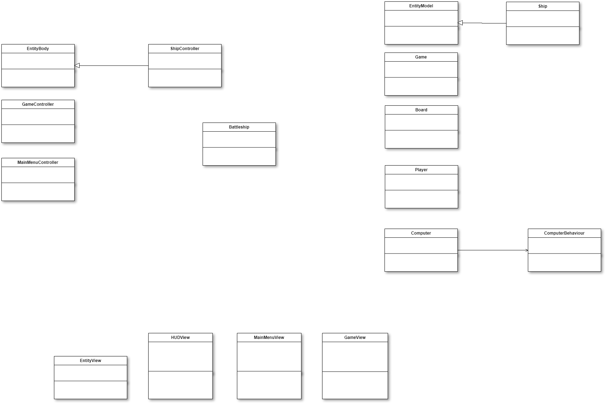
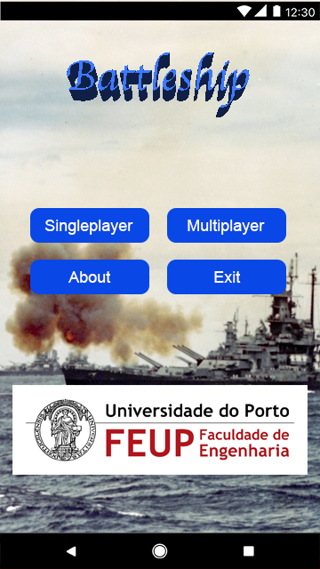
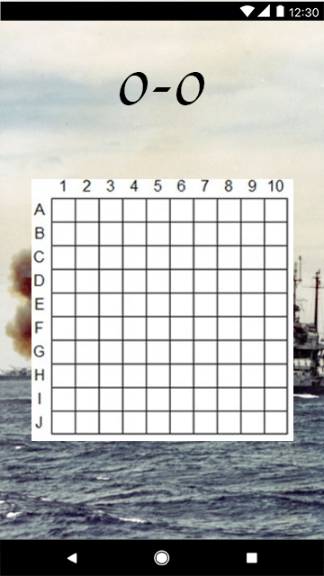

## Final Project Intermediate Check-Point

### 1.Architecture Design

#### 1.1 UML

#### 1.2 Design Patterns
*   [Singleton Pattern](https://en.wikipedia.org/wiki/Singleton_pattern) - Avoid creating more than one intance of a object.
*   [State Pattern](https://en.wikipedia.org/wiki/State_pattern) - Controls the game flow .
*   [Strategy Pattern](https://en.wikipedia.org/wiki/Strategy_pattern) - Controls the AI behaviour.
*   [DoubleBuffer]() - Implemented by Libgdx in Graphics Management (in GameView Class)
*   [Template Method](https://en.wikipedia.org/wiki/Template_method_pattern) - Implemented by Libgdx in GameLoop (GameView, GameModel, Game Controller classes)

#### 1.3 Design Decisions
*   [MVC Design Pattern](https://en.wikipedia.org/wiki/Model%E2%80%93view%E2%80%93controller) - Software architectural pattern

### 2.GUI Design

### 3.Test Design

We expect to test this application by devoloping JUnit tests for:

1.  Placing ships on the map.
2.  Basic actions like shooting.
3.  Cases where the game is suposed to end.
4.  Battleship AI.

----

GROUP1743, 29/04/2018

> Bernardo Manuel Costa Barbosa, up201503477@fe.up.pt
> João Pedro Teixeira Pereira de Sá, up201506252@fe.up.pt
